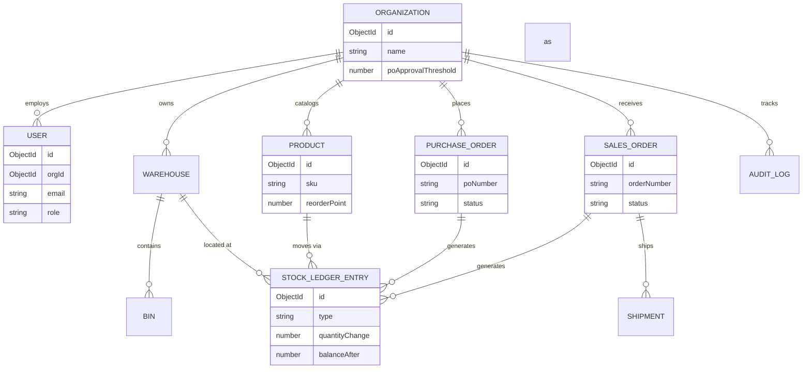
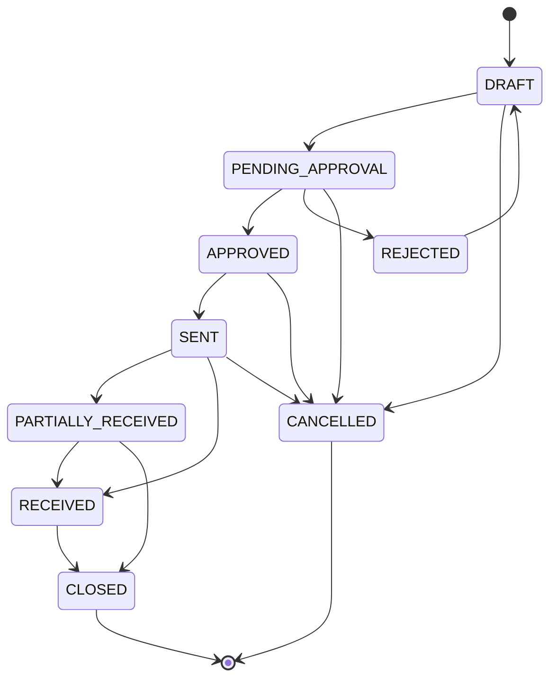
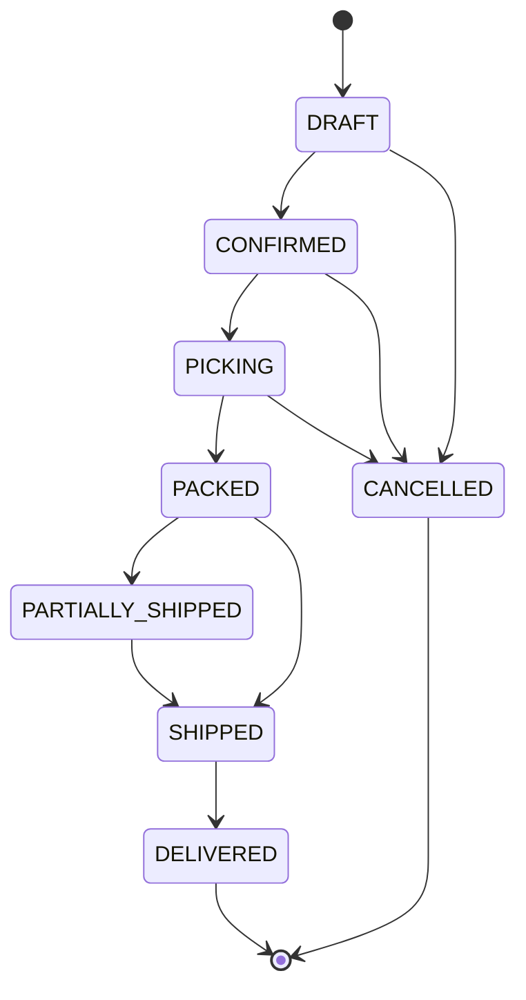

# Tally

**Tally** is a multi-tenant Warehouse & Order Fulfillment Management System.
It models the real lifecycle of goods through a small business — purchase
orders, receiving, inventory, picking, packing, and shipping — as explicit,
enforced state machines rather than a flat CRUD list.

Built on the MERN stack (MongoDB, Express, React, Node) with TypeScript
throughout.

## Why this exists

Most student inventory projects are a products table with a `quantity`
field you increment and decrement. That field lies to you the moment two
requests touch it at once, and it gives you no way to answer "why does this
number say 40 when there are 35 units on the shelf?"

Tally is built around two design decisions instead:

1. **Stock is never stored, only derived.** Every change to inventory —
   a PO receipt, an order pick, a manual adjustment — is one row in an
   append-only `StockLedgerEntry` collection. Current stock for a SKU is
   the sum of its ledger entries. Nothing can silently drift out of sync,
   because there's nothing to drift — the ledger *is* the stock.
2. **Every business object has an explicit state machine.** A purchase
   order can't jump from `DRAFT` to `RECEIVED`. The valid transitions are
   defined once, in code, and the service layer rejects anything else.

## Tech stack

| Layer      | Choice                                                              |
|------------|----------------------------------------------------------------------|
| Frontend   | React 19, TypeScript, Vite, TailwindCSS, shadcn/ui, TanStack Query   |
| Backend    | Node.js, Express, TypeScript, Mongoose (multi-document transactions) |
| Data       | MongoDB (primary store), Redis (jobs, rate limiting, caching)        |
| Jobs       | BullMQ — low-stock alerts, expiry checks, SLA-breach checks          |
| Realtime   | Socket.IO — live stock updates across warehouse staff screens        |
| Auth       | JWT access + refresh token rotation, org-scoped RBAC                 |
| Infra      | Docker Compose (local), GitHub Actions (CI), Mongo Atlas + Redis Cloud + Railway/Render + Vercel (prod) |

## Data model



## Purchase order lifecycle



## Sales order (fulfillment) lifecycle



## Roadmap

- [x] **Phase 1** — Schema, ERD, and state-machine design
- [ ] Phase 2 — Auth + org/RBAC (multi-tenant)
- [ ] Phase 3 — Product/SKU catalog + stock ledger service
- [ ] Phase 4 — Purchase order lifecycle + approval workflow
- [ ] Phase 5 — Receiving: barcode scan-in, variance detection, bin assignment
- [ ] Phase 6 — Outbound fulfillment: pick, pack, ship, partial shipments
- [ ] Phase 7 — Background jobs: low-stock, expiry, SLA-breach alerts
- [ ] Phase 8 — Real-time dashboard + analytics
- [ ] Phase 9 — Audit log + security hardening
- [ ] Phase 10 — Docker, CI, deployment, seed data, public demo login

## Local setup

```bash
cp .env.example .env
docker compose up -d mongo redis
cd server
npm install
npm run dev
```

## License

MIT — see [LICENSE](./LICENSE).
